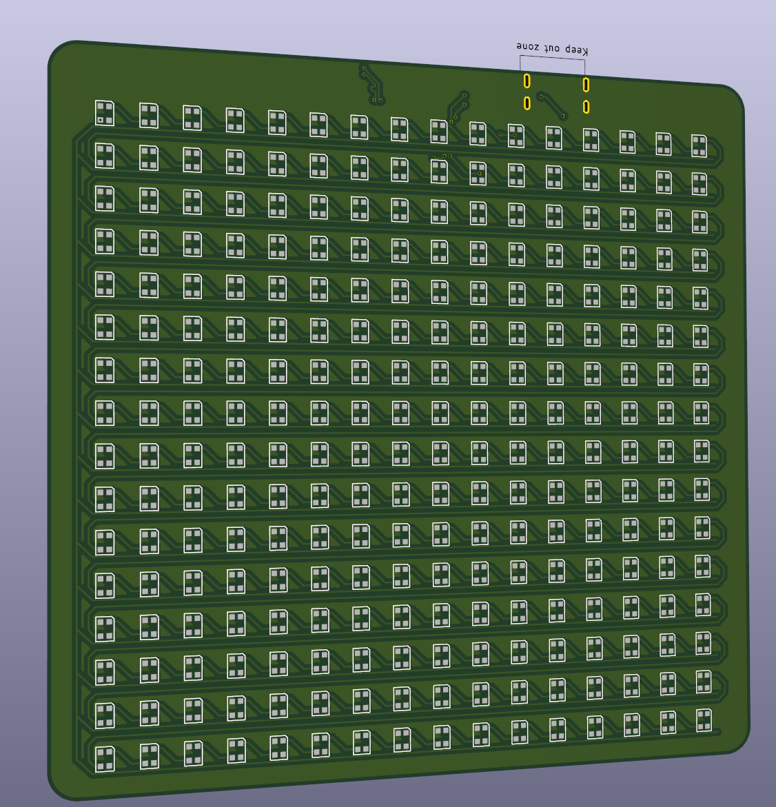

# The Pyramid of brightness

Wokwi link: [https://wokwi.com/projects/428436537148664833](https://wokwi.com/projects/428436537148664833)

This was supposed to be a pyramid (or more of a triagle) but I thought I'd be too difficult to arrange the pixels in a neat way. So I made it a square. The name stuck. So Introducing the Pyramid of brightness featuring: USB C connection, sleek design with rounded corners, a whopping 16mb of storage for your precious animations, the power of a pure RP2040, a barometer and a gyroscope.

The baro and gyro were added as fun gimmicks to visualize something real with. Coding without iterating is hard so I'll finish the firmware when I get my board. The purpose of The Pyramid of Brightness is to sit on the corner of my desk and play around with when I'm bored. Also to take to events like LAN parties.

I has this idea of making a snake game where you control the snake by tilting the device. And this is just perfect for that.

## A super rough BOM
| Id          | Designator                  | Footprint                                      | Quantity | Designation                 | cost |
| ----------- | --------------------------- | ---------------------------------------------- | -------- | --------------------------- | ---- |
| 1           | J4                          | SolderJumper-2_P1.3mm_Open_RoundedPad1.0x1.5mm | 1        | Conn_01x02                  | 0    |
| 2           | C18,C16                     | C_0805_2012Metric                              | 2        | 10u                         | 0,1  |
| 3           | C22,C19,C21,C25,C17,C26,C24 | C_0805_2012Metric                              | 7        | 100n                        | 0,2  |
| 4           | R8,R10                      | R_0603_1608Metric                              | 2        | 1K                          | 0,1  |
| 5           | R11,R12                     | R_0603_1608Metric                              | 2        | 27                          | 0,1  |
| 6           | J3                          | USB_C_Receptacle_Amphenol_124019772112A        | 1        | USB_C_Receptacle_USB2.0_14P | 0,7  |
| 7           | U3                          | Texas_RGY_R-PVQFN-N20_EP2.05x3.05mm            | 1        | TXB0108RGY                  | 1    |
| 8           | U5                          | SOT-223-3_TabPin2                              | 1        | NCP1117-3.3_SOT223          | 1    |
| 9           | C23,C20                     | C_0805_2012Metric                              | 2        | 1u                          | 0,1  |
| 10          | X2                          | ABM8-272-T3_ABR                                | 1        | ABM8-272-T3                 | 1    |
| 11          | C14,C15                     | C_0805_2012Metric                              | 2        | 15p                         | 0,1  |
| 12          | R9,R7                       | R_0603_1608Metric                              | 2        | 5K1                         | 0,1  |
| 13          | U6                          | QFN-56-1EP_7x7mm_P0.4mm_EP3.2x3.2mm            | 1        | RP2040                      | 5    |
| 14          | U4                          | SOIC-8_5.3x5.3mm_P1.27mm                       | 1        | W25Q128JVS                  | 1    |
| 15          | R1                          | R_0603_1608Metric                              | 1        | 50K                         | 0,1  |
| 16          | Leds                        | LED_WS2812B-2020_PLCC4_2.0x2.0mm               | 256      | WS2812B-2020                | 10   |
| 17          | C2,C1                       | C_0805_2012Metric                              | 2        | 100nF                       | 0,1  |
| 18          | U2                          | PQFN50P300X250X97-14N                          | 1        | ICM-42688-P                 | 1    |
| 19          | C4                          | C_0805_2012Metric                              | 1        | 0.1uF                       | 0,1  |
| 20          | U1                          | PQFN50P200X200X80-10N                          | 1        | BMP388                      | 1    |
| 21          | C3                          | C_0805_2012Metric                              | 1        | 2.2uF                       | 0,1  |
| 22          | C5                          | C_0805_2012Metric                              | 1        | 10nF                        | 0,1  |
| Rough total |                             |                                                |          | 23                          |

Did I have problems with this. Yes, I did. The Scematic was super fun to make but trying to get Kicad to arrange the leds in a grid or route a differential pair without making huge skews was not fun at all.